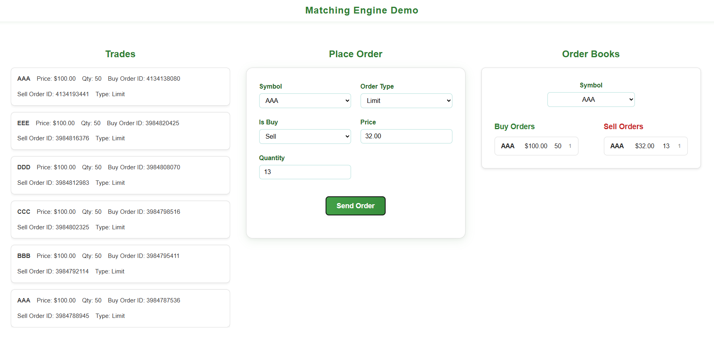
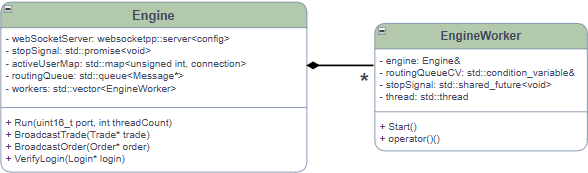
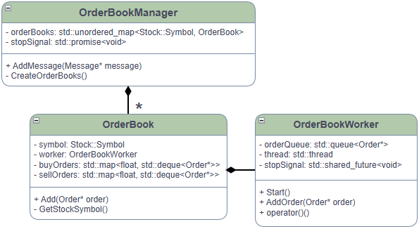
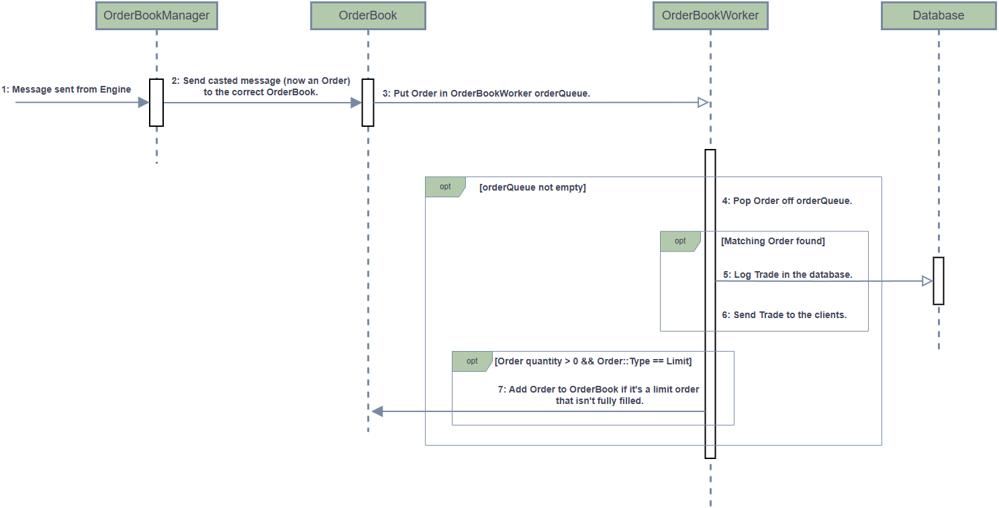
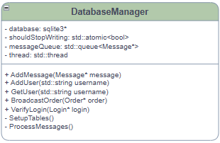

## About  
##### The main goal of this project was to build a small fullstack app inspired by techniques used in high-frequency trading. The backend is written entirely in C++20, with a simple single-page client. Communication between client and server happens exclusively through WebSockets for simplicity, and all data is stored in a SQLite database on the server.  

## Features  
- 🚀 Multithreading for handling multiple users with high throughput.  
- 📡 Custom binary messaging over WebSockets for smaller, faster messages.  
- 🗄️ Dedicated database writer thread so reads/writes don’t block.  
- ⚡ Responsive, event-driven UI.  
- ✅ Unit testing across all components using Google Test.  

## Architecture  

### Engine  
- Tracks users and their WebSocket connections.  
- Handles initial messages and routes them to either the **OrderBookManager** or **DatabaseManager**.  
- Provides broadcast functions to send data back to clients.  
- Verifies login messages with the database (not full authentication, just a username).  
- Manages the lifetimes of all **EngineWorkers** using a promise/shared_future.  

#### Simplified UML  
  
##### The **Engine** singleton and its workers are simpler than the **OrderBookManager**, so a sequence diagram wasn’t necessary. The Engine deserializes messages from WebSockets and places them into its `routingQueue`. Workers then pull messages off the queue and decide where they should go.  

Both **Engine** and **OrderBookManager** classes declare their workers as `friend`, giving them full access.  

### Order Book Manager  
- Creates and manages all **OrderBooks**.  
- Routes order-related messages to the correct **OrderBook**.  
- Manages the lifetimes of all **OrderBookWorkers** using a promise/shared_future.  

#### Simplified UML  
  

#### Sequence Diagram  
  

### Database Manager  
- Initializes the SQLite database.  
- Provides functions for adding/retrieving users and trades.  
- Runs and manages a dedicated writer thread for inserting trades into the database.
#### Simplified UML

##### The **DatabaseManager** has a queue for messages, which are handled by `ProcessMessages()` on a separate writer thread. The `std::atomic<bool>` is used for lifetime management instead of a promise/shared future. Using future's and a functor for this (creating a DatabaseWorker object) just seemed unessary considering there would only be one writer thread. 

## Conclusion  
##### This project was a great refresher on multithreading in C++ and gave me my first hands-on experience building a web application with C++. Using the **websocketpp** library alongside **SQLite** made the process relatively straightforward while still offering plenty of technical challenges.  

##### Top 3 Things I Learned  
- How to utilize WebSockets effectively in C++.  
- How to integrate SQLite into a C++ backend.  
- How to design and implement a C++ server for a web-based client.  
